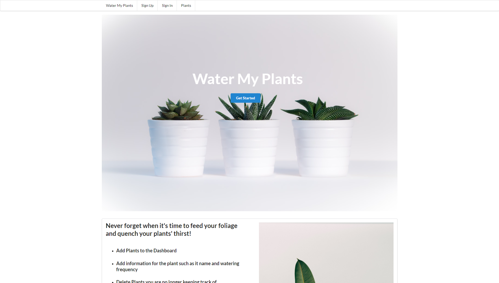
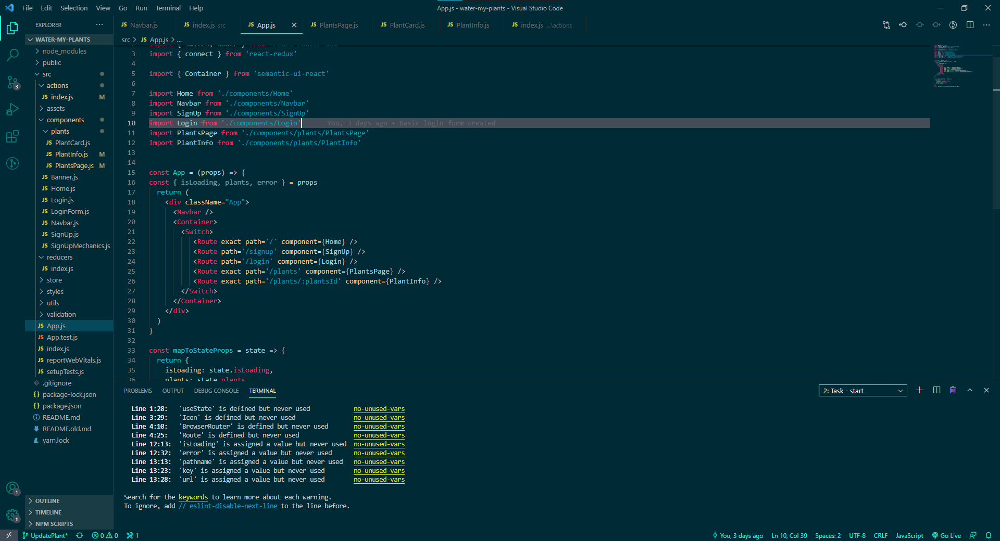
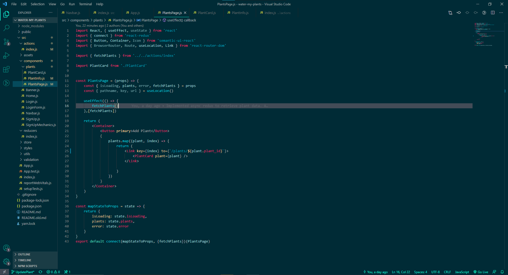
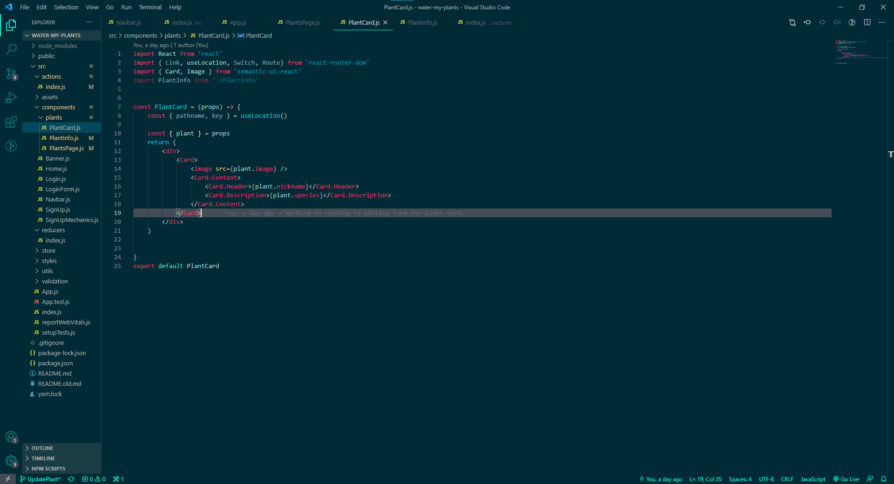
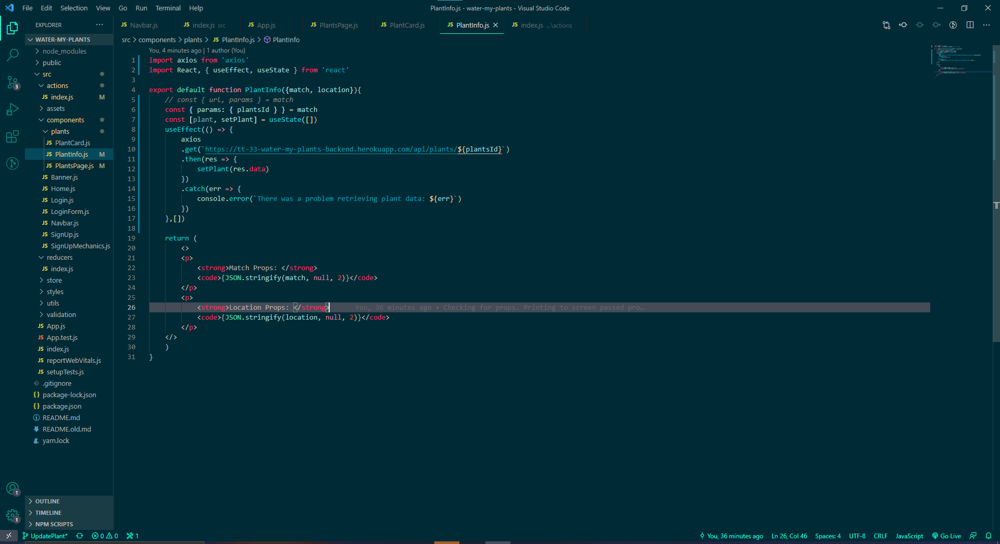

 
"Water My Plants" is a Lambda School "Build Week" collab project where contributors built a fullstack CRUD application in just a (work) weeks time. If you want a brief explanation into all of the moving parts, read on! 
 
Within the Web app you can:  
 
Authorization & Authentication: Sign in or Sign Out.
Create: Create new plant card.
Read: Get a list of the current plants available on the dashboard.
Update: Update a plant card's information.
Delete: Delete cards that YOU create.
 
 

 
The first thing to do was to set the routing for the app. Making sure most static routes exist to give way for a few dynamic routes later on down the line. Then we connected the App file, the root of the application, to the redux store so that we could get all the available props drilled to the child components being rendered by each individual route.
 
 

 
The next thing to do was make an axios GET request to the server so we could populate the frontend. In the useEffect hook, you'll notice a single function invocation. It's been abstracted away as an action creator, that fires every time the PlantPage component mounts.
 
 

 
When the axios request returns the data, we used that data to dynamically render a card for every plant. The cards were also links to the plant's page, where the editing and deleting of the plants occurs.
 
 

 
All that was left was to use the id of the plant, being returned from the server (that was then passed as a prop to each indivdual card). With a bit of object desconstruction, now we could dynamically request a plant based on it's id, and the URL would relfect that! 
 
 
 
There's definiely a lot more that went into building this out, and I encourage you to take a look at the source code! Thanks for reading! 

